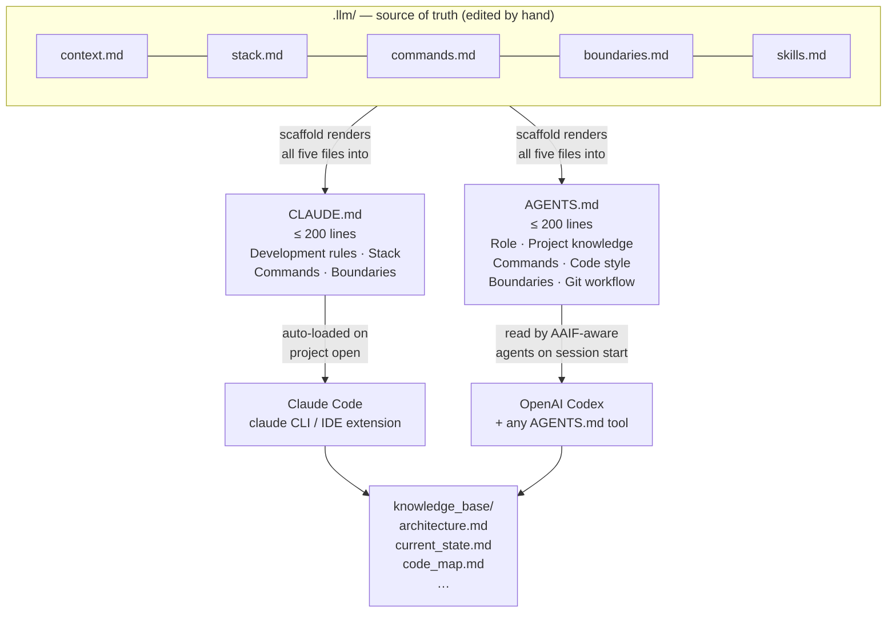
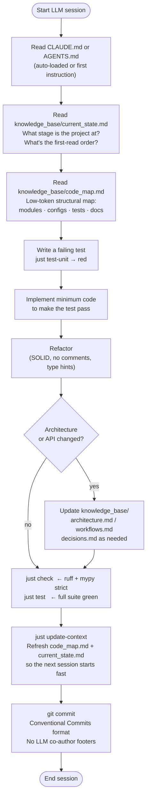

# LLM Context Files

The template generates token-efficient context files for Claude Code and OpenAI Codex.
Both are rendered from the same `.llm/` source of truth at scaffold time — they never
drift because they have one origin.

---

## The .llm/ directory

Five small files that define everything an LLM assistant needs to know:

| File | Content | Purpose |
|------|---------|---------|
| `context.md` | Project identity: name, author, repo, Python version, license | who + what |
| `stack.md` | Toolchain, EO/SAR libraries, architecture summary, conventions | how it's built |
| `commands.md` | Every `just` command with a one-line description | what to run |
| `boundaries.md` | Three sections: Always / Ask first / Never | what's allowed |
| `skills.md` | Useful assistant capabilities for the package | where to focus |

---

## From source to rendered files



!!! important "Update `.llm/`, then sync the rendered files"
    Cookiecutter writes CLAUDE.md and AGENTS.md once at scaffold time.
    As your project evolves, edit `.llm/` first, then copy the changed
    sections into CLAUDE.md and AGENTS.md by hand.
    The test suite will catch any file that exceeds 200 lines.

---

## Session lifecycle



`just update-context` is lightweight — it runs a stdlib-only script that walks
the source tree and rewrites `knowledge_base/code_map.md` and
`knowledge_base/current_state.md`. No third-party code indexers, no upload.

---

## Why the 200-line limit matters

Context files have a token cost on every API request. Keeping them under 200 lines means:

- **Cheaper sessions** — fewer tokens consumed before any code is written
- **Faster orientation** — assistants read the whole file, not excerpts
- **Forced curation** — you can't defer the decision "does this belong in context?"

The limit is enforced automatically by `test_claude_md_under_200_lines` and
`test_agents_md_under_200_lines` in `tests/test_structure.py`. A CI failure
tells you immediately when a context file grows too large.

Keep context files lean by:

- Describing patterns, not implementations
- Linking to `knowledge_base/` for deep detail
- Deleting stale information immediately
- Never auto-generating content — write every line by hand

---

## CLAUDE.md

Used by [Claude Code](https://docs.anthropic.com/en/docs/claude-code/overview).
Loaded automatically when you open a project in Claude Code.

**Structure:**

```markdown
# Project name
Short description.

## Required knowledge   ← what to read before touching code
## Development rules    ← project-specific TDD/SOLID rules
## Stack                ← from .llm/stack.md
## Commands             ← from .llm/commands.md
## Boundaries           ← from .llm/boundaries.md

---
Source of truth: .llm/  |  Keep this file under 200 lines
```

Hard limit: **200 lines**. Enforced by `test_claude_md_under_200_lines`.

---

## AGENTS.md

Follows the [AAIF AGENTS.md specification](https://github.com/agentprotocol/aaif).
Used by OpenAI Codex and other AGENTS.md-aware tools.

**Structure:**

```markdown
# AGENTS.md — Project name

## Role          ← brief instruction to the agent
## Project knowledge   ← from .llm/context.md + .llm/stack.md
## Commands      ← from .llm/commands.md
## Code style    ← ruff/mypy/naming conventions
## Boundaries    ← from .llm/boundaries.md
## Git workflow  ← branch naming + Conventional Commits rules
```

Hard limit: **200 lines**. Enforced by `test_agents_md_under_200_lines`.

---

## primary_llm flag

| Value | Generated files | Post-gen hook removes |
|-------|----------------|----------------------|
| `both` (default) | CLAUDE.md + AGENTS.md | nothing |
| `claude` | CLAUDE.md + AGENTS.md | AGENTS.md |
| `codex` | CLAUDE.md + AGENTS.md | CLAUDE.md |

The `.llm/` directory is **always** present regardless of `primary_llm` —
it is the source of truth, not the rendered output.

---

## Context economy without supply-chain risk

Generated projects include two lightweight context files refreshed by
`just update-context`:

| File | Purpose |
|------|---------|
| `knowledge_base/code_map.md` | Structural map of modules, configs, tests, docs, and key commands |
| `knowledge_base/current_state.md` | Current stage, first-read order, and open implementation work |

The updater is `scripts/update_code_map.py` — a stdlib-only Python script with
no third-party code-indexing executables. It gives Claude Code, Codex, and other
agents a low-token starting point for new sessions without adding supply-chain risk.

---

## Updating after scaffold

As the codebase evolves, update `.llm/` and then sync CLAUDE.md and AGENTS.md manually.
A future release will add a `just sync-llm` command to automate this.

For now: when you update `.llm/stack.md` or `.llm/boundaries.md`, copy the relevant
sections into CLAUDE.md and AGENTS.md. The test suite will catch any files that exceed
200 lines.
