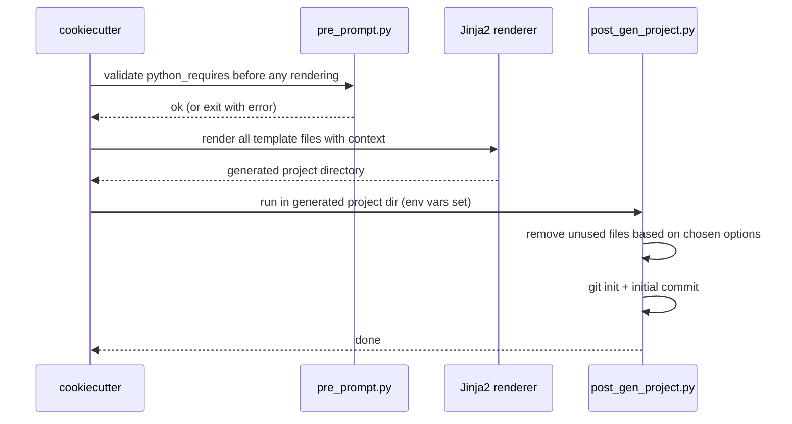

# Hooks

Cookiecutter hooks run Python scripts before and after rendering.



---

## How hooks read template variables

`post_gen_project.py` reads your cookiecutter choices via environment variables:

```python
primary_llm = os.environ.get("COOKIECUTTER_PRIMARY_LLM", "both")
```

Cookiecutter (2.2+) automatically sets `COOKIECUTTER_<VARIABLE_NAME_UPPERCASE>`
in the environment before running each hook. This makes the hook a plain Python
script — no Jinja2 templating inside the hook itself — which means every function
can be unit-tested in isolation by simply setting the env var and calling the function.

The test helper `tests/helpers/render.py` replicates the same env var injection
so that approval tests match exactly what a real `uvx cookiecutter` run produces.

---

## pre_prompt.py

Validates `python_requires` before the template renders. Exits with an error
if an unsupported Python version string is supplied.

**Accepted values**: `>=3.10` · `>=3.11` · `>=3.12`

---

## post_gen_project.py

Runs in the freshly rendered project directory. Each concern is its own
single-responsibility function — no logic lives in `main()`.

### Functions

#### `generate_llm_context(project_dir)`
Runs `scripts/sync_llm.py --init` to build `CLAUDE.md` and `AGENTS.md` from the
rendered `.llm/` files. This is why the template ships **no** hand-written
CLAUDE.md/AGENTS.md — they are generated, so `.llm/` is the only source of their
content. Runs before the `primary_llm` removal below, so the unwanted file is
generated and then deleted.

#### `remove_agents_md(project_dir)`
Deletes `AGENTS.md` when `primary_llm == "claude"`.
The developer only needs Claude Code context; the OpenAI AGENTS spec is removed.

#### `remove_claude_md(project_dir)`
Deletes `CLAUDE.md` when `primary_llm == "codex"`.
The developer only needs the AGENTS.md spec; the CLAUDE.md file is removed.

#### `remove_approval_tests(project_dir)`
Removes `tests/approval/` when `test_scheme == "unit"`.

#### `remove_hypothesis(pyproject_path)`
Strips the `hypothesis` line from `pyproject.toml` dev deps when the selected
test scheme is `unit` or `unit_and_approval`. All other deps are preserved.

#### `configure_test_scheme(project_dir, pyproject_path, scheme)`
Applies the selected test scheme:

| Scheme | Result |
|--------|--------|
| `unit` | unit tests only; removes approval tests and hypothesis |
| `unit_and_approval` | keeps approval tests; removes hypothesis |
| `full` | keeps unit tests, approval tests, and hypothesis |

#### `remove_mkdocs(project_dir, pyproject_path)`
Removes `docs/` and all `mkdocs*` lines from `pyproject.toml` when
`include_mkdocs == "n"`.

#### `remove_github_actions(project_dir)`
Removes `.github/` when `ci_platform == "gitlab"`.

#### `remove_gitlab_ci(project_dir)`
Removes `.gitlab-ci.yml` when `ci_platform == "github"`.

#### `init_git(project_dir)`
Runs `git init && git add . && git commit` with message:

```
chore: initial scaffold from cookiecutter-eo-llm
```

No LLM co-author footers are added.

#### `print_next_steps(project_dir, project_slug)`
Prints a concise onboarding message after all other steps complete.

### Composition

`main()` reads the cookiecutter context from environment variables and
calls the above functions in order. No conditional logic lives in `main()`.

---

## Testing hooks

Hook functions are tested in isolation in `tests/test_hooks.py`.
Each test creates a minimal fake project directory and asserts the
expected file system state after the function runs.

```bash
uv run pytest tests/test_hooks.py -v
```
