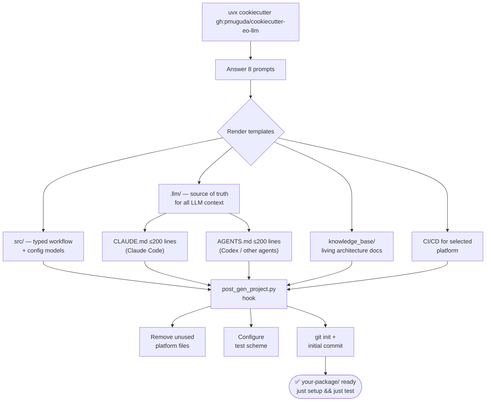
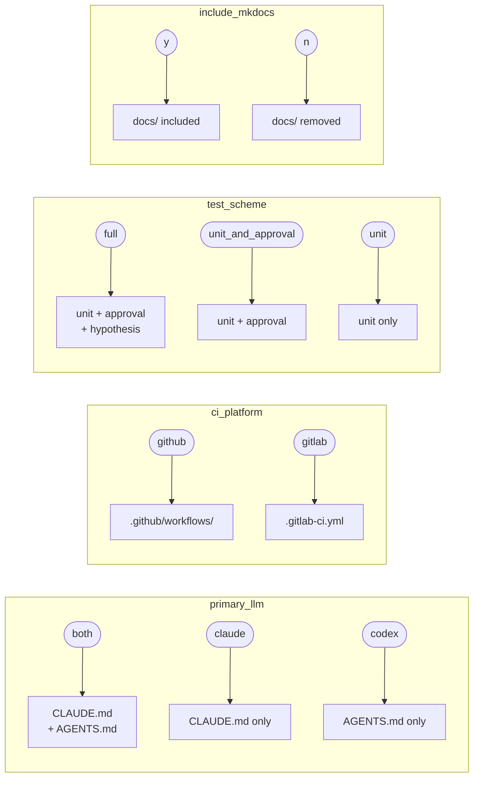

# cookiecutter-eo-llm

**A production-minded EO/SAR Python package template with TDD workflows and
LLM-ready context for Claude Code and Codex.**

One command gives you a typed, tested, LLM-aware Python package: a concrete
workflow class, a plain YAML config model, a living knowledge base, and
token-efficient context files that keep AI assistants grounded in
your project's rules — all from a single `.llm/` source of truth.

---

## Why this template?

EO/SAR work follows a predictable trajectory:


This template interrupts that trajectory at step one.

| Problem | How the template solves it |
|---------|---------------------------|
| CLAUDE.md and AGENTS.md drift apart | Both rendered from the same `.llm/` source of truth |
| Boilerplate for every new package | One command scaffolds a fully wired project |
| LLM context files bloat quickly | Hard 200-line limit enforced by tests |
| Inconsistent tooling across projects | uv + ruff + mypy strict + pytest everywhere |
| Notebook-to-package migration is messy | One workflow class + one config file + tests from day 1 |
| Heavy geospatial dependencies added too early | Runtime deps stay small; EO libraries added only when needed |
| New LLM sessions spend tokens rediscovering structure | `code_map.md` and `current_state.md` give agents a cheap first read |

---

## How it works



The post-gen hook runs once and leaves the project in a clean, committed state
with only the files you asked for.

---

## What you get

```
my-eo-package/
├── src/my_eo_package/       ← importable package (snake_case)
│   ├── logger.py            ← get_logger(name) for consistent logging
│   ├── workflow/            ← abstract base + concrete implementation
│   ├── config/              ← SourceModel / ComputeParamsModel / DestinationModel
│   └── main.py              ← typer CLI + run_<project_slug>() entry point
├── .llm/                    ← single source of truth for LLM context
├── knowledge_base/          ← living architecture docs
├── tests/                   ← unit / integration / approval suites
├── CLAUDE.md                ← rendered from .llm/ (≤200 lines)
├── AGENTS.md                ← rendered from .llm/ (≤200 lines)
├── Justfile                 ← all dev commands in one place
└── pyproject.toml           ← hatchling + uv, fully wired
```

---

## Quick install

```bash
uvx cookiecutter gh:pmuguda/cookiecutter-eo-llm
```

→ [Full quickstart guide](quickstart.md)

---

## What you configure at scaffold time

Eight prompts control the entire project shape. Six of them are **feature
flags** — the post-gen hook removes any files that don't apply.



→ [Full variable reference](variables.md)

---

## Core principles

- **TDD everywhere** — every feature built test-first
- **SOLID** — one responsibility per function and class
- **No comments** — rename and simplify instead
- **uv only** — no pip, no Poetry
- **Tokens are gold** — LLM context files stay lean and human-curated
- **Context economy** — `just update-context` refreshes a local code map without extra tooling
- **Single source of truth** — `.llm/` drives both CLAUDE.md and AGENTS.md
- **Docs move with code** — architecture, workflow, and API changes update docs too
- **Conventional Commits** — feat/fix/chore with SemVer mapping

## Credits

This template stands on Cookiecutter, uv, hatchling, ruff, mypy, pytest,
Pydantic, Typer, PyYAML, MkDocs, GitHub Actions, and GitLab CI.
