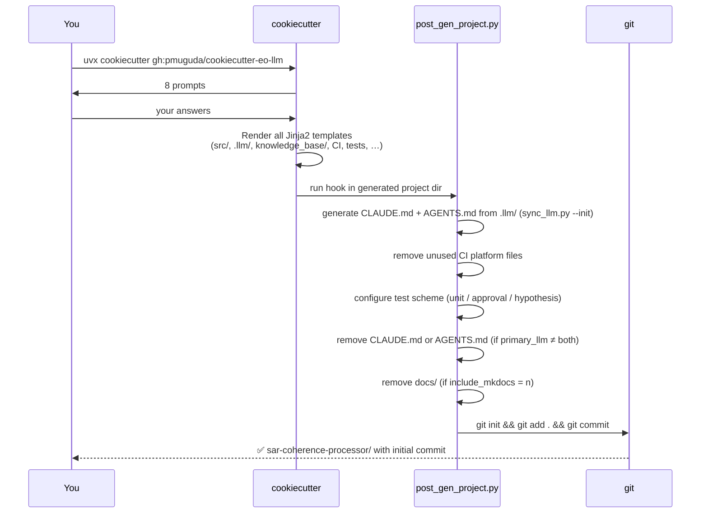

# Quickstart

## Prerequisites

- Python 3.10+
- [uv](https://docs.astral.sh/uv/) — the only package manager used in any generated project

Install uv if you don't have it:

```bash
curl -LsSf https://astral.sh/uv/install.sh | sh
```

---

## Generate a project

```bash
uvx cookiecutter gh:pmuguda/cookiecutter-eo-llm
```

You will be prompted for eight values:

```
full_name [Chuck Norris]: Ada Lovelace
email [chuck@example.com]: ada@example.com
repository_owner [chucknorris]: alovelace
project_name [My EO Package]: SAR Coherence Processor
project_short_description [...]: Sentinel-1 InSAR coherence estimation pipeline.
version [0.1.0]:
python_requires [>=3.10]:
license [MIT]:
primary_llm [both]:
include_mkdocs [y]:
ci_platform [github]:
test_scheme [full]:
open_source [y]:
```

!!! tip "Automated / CI usage"
    Skip all prompts with `--no-input`:
    ```bash
    uvx cookiecutter gh:pmuguda/cookiecutter-eo-llm --no-input
    ```

---

## What happens under the hood



The hook is a plain Python script with single-responsibility functions — nothing
hidden, fully testable. See [Hooks](hooks.md) for the detailed breakdown.

---

## Run the generated project

```bash
cd sar-coherence-processor
just setup          # uv sync --dev + pre-commit install
just test           # full test suite
just update-context # refresh low-token LLM context
just run config/config_sar_coherence_processor.yml
```

Expected output:

```
source:    data/input.tif
crs:       EPSG:32632
output:    data/output.tif
overwrite: False
```

---

## Verify everything is wired

```bash
just check          # ruff + mypy strict — zero errors expected
just test           # all tests green
```

---

## Next steps

1. Read [`knowledge_base/architecture.md`](structure.md) — understand the Workflow pattern
2. Add your first real workflow → [Adding a workflow guide](guides/add-workflow.md)
3. Update `.llm/` files as your architecture evolves
4. Push to your selected Git platform and watch CI run automatically
