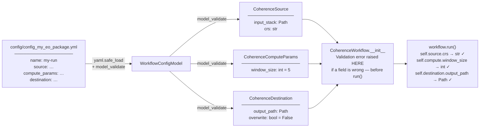
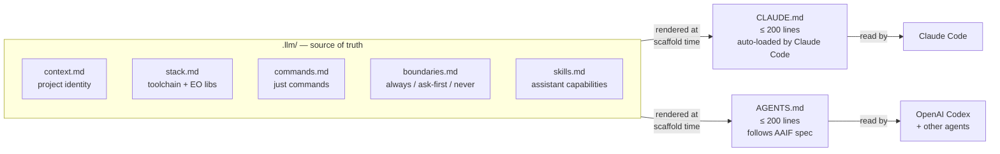

# Generated Project Structure

Running `uvx cookiecutter gh:pmuguda/cookiecutter-eo-llm` with `project_name = "My EO Package"` produces:

```
my-eo-package/                          ← project_dir (kebab-case)
├── pyproject.toml                      ← hatchling build, all deps, ruff/mypy config
├── Justfile                            ← all dev commands
├── README.md                           ← badges + quick-start
├── CHANGELOG.md                        ← Keep a Changelog format
├── CONTRIBUTING.md                     ← PR checklist, commit convention
│
├── CLAUDE.md                           ← rendered from .llm/  (≤200 lines)
├── AGENTS.md                           ← rendered from .llm/  (≤200 lines)
│
├── .llm/                               ← single source of truth for LLM context
│   ├── context.md                      ← project identity and metadata
│   ├── stack.md                        ← toolchain + EO stack + conventions
│   ├── commands.md                     ← all Justfile commands documented
│   ├── boundaries.md                   ← always / ask-first / never rules
│   └── skills.md                       ← useful LLM skills for this package
│
├── knowledge_base/                     ← living docs — update as you code
│   ├── architecture.md                 ← package layout, Workflow pattern
│   ├── workflows.md                    ← one entry per concrete workflow
│   ├── decisions.md                    ← ADRs: why this lib, why this pattern
│   ├── changelog_context.md            ← plain-English summary since last release
│   ├── code_map.md                     ← low-token structural map for agents
│   └── current_state.md                ← current project state and first-read order
│
├── config/
│   └── config_my_eo_package.yml        ← plain YAML workflow config
│
├── src/
│   └── my_eo_package/                  ← project_slug (snake_case)
│       ├── __init__.py                 ← exposes __version__
│       ├── py.typed                    ← PEP 561 marker
│       ├── main.py                     ← run_<project_slug>() + typer CLI
│       ├── workflow/
│       │   ├── base.py                 ← abstract Workflow(ABC)
│       │   └── example.py             ← ExampleWorkflow
│       └── config/
│           └── models.py              ← SourceModel / ComputeParamsModel / DestinationModel / WorkflowConfigModel
│
├── tests/
│   ├── conftest.py                     ← shared pytest fixtures
│   ├── helpers/
│   │   └── config_builder.py          ← WorkflowConfig factory functions
│   ├── resources/
│   │   ├── config_my_eo_package.yml
│   │   └── invalid_workflow.yaml
│   ├── unit/
│   │   ├── test_main.py
│   │   ├── test_base_workflow.py
│   │   ├── test_example_workflow.py
│   │   └── test_config_models.py
│   ├── integration/
│   │   └── .gitkeep
│   └── approval/
│       ├── test_approval.py
│       └── approved_files/
│
├── notebooks/
│   └── 00_my_eo_package_exploration.ipynb
├── scripts/
│   ├── example_script.py
│   └── update_code_map.py              ← refreshes code_map/current_state
├── docs/
│   ├── mkdocs.yml
│   ├── index.md
│   └── api/index.md
│
├── .github/
│   └── workflows/
│       └── ci.yml                      ← build, test, docs, and PyPI publish
├── .gitlab-ci.yml
├── .pre-commit-config.yaml             ← ruff + mypy hooks
├── .gitignore
└── .editorconfig
```

---

## Key design decisions

### kebab vs snake naming

The two cookiecutter variables enforce a deliberate split:

- **`project_dir`** (`my-eo-package`) → filesystem, PyPI, CLI command  
- **`project_slug`** (`my_eo_package`) → Python imports, `src/` subfolder

### One package = one workflow

Each generated package is purpose-built for a single workflow. `main.py` imports
the workflow class directly — no type dispatch, no registry.

When you scaffold the project, rename `ExampleWorkflow` to your domain class and
update the single import in `main.py`. That is the only change needed.

### Config model design

Every EO workflow follows the same data shape regardless of algorithm:



The three empty base models (`SourceModel`, `ComputeParamsModel`, `DestinationModel`)
define the grouping contract. Each concrete workflow subclasses all three and adds
its own typed fields. See [Config Model Design](guides/config-design.md) for the
full rationale and the flat-dict alternative compared.

### .llm/ as single source of truth



CLAUDE.md and AGENTS.md are both written from the same `.llm/` files at scaffold time.
When the project evolves, update `.llm/` — then manually sync the relevant sections
into CLAUDE.md and AGENTS.md. The test suite enforces the 200-line hard limit on both files.

`skills.md` names the assistant capabilities that are useful for this project,
such as Python packaging, EO/SAR workflow design, geospatial review, docs, and CI/CD.

### knowledge_base/ as living docs

These files are the durable project memory for developers and LLM assistants.
Run `just update-context` to refresh `code_map.md` and `current_state.md` after
any structural change.

| File | Updated when |
|------|-------------|
| `architecture.md` | layout changes, new patterns |
| `workflows.md` | any workflow is added or changed |
| `decisions.md` | a non-obvious design choice is made |
| `changelog_context.md` | before a release — reset after tagging |
| `code_map.md` | after module, config, test, or docs structure changes |
| `current_state.md` | after meaningful development milestones |
